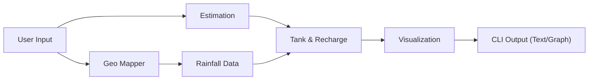

# RainSense: CLI-based Rooftop Rainwater Harvesting Estimator

**Authors:** Shiva G (2023PECCS493), Sijo Santhosh (2023PECCS498)  
**Department:** Computer Science and Engineering  
**Guide:** Sasikumar A N | **Coordinator:** Dr. Subedha V  
**Institution:** Panimalar Engineering College, Chennai, India  
**Email:** {shivagurumurthy121@gmail.com, sijosanthosh2@gmail.com}

---

## Abstract

A major problem impacting many countries is water shortage. Many places continue to lack water throughout the year even in areas with high precipitation for a few months. Surface runoff accounts for a lot of the rainwater lost, therefore pointing up inefficiencies in present water management approaches. Rooftop rainwater gathering (RRWH) presents a sensible solution; however, the complexity of calculating harvestable water restricts the uptake of such systems. RainSense solves this issue by offering a Python command-line tool that counts the possible quantity of rainwater that may be gathered from rooftops. To provide precise estimations, the tool takes into account transmission losses, roof material effectiveness, and storage constraints among other considerations. Simple graphic outputs, user-friendliness, handling of huge datasets, geolocation, and computations are all within the reach of RainSense. Offering a quick and dependable way to manage water resources, it is appropriate for institutions, private homeowners, and urban planners.

---

## Keywords

Python CLI, NetCDF, sustainable water management, estimation model, rainwater harvesting, water conservation

---

## I. Introduction

Water shortages are an always-important worldwide problem. Irregular weather patterns, urban growth, and population increase all add to the failure of conventional water sources to satisfy demand. While rain falls in many places, a great deal of it runs away as surface runoff unused. Capturing rooftop rainwater offers a chance to gather it at its origin and so lessen reliance on traditional water supplies.  

Estimating the volume of water that can be gathered is not easy since it depends on several variables including roof area, rainfall intensity, material efficiency, and transmission losses. Developed to solve these problems is the command-line utility RainSense. It lets users quickly determine rooftop rainwater harvesting capacity without a lot of human involvement or sophisticated calculations. Simple, scalable, and data-driven insights from the tool help to guide educated choices for sustainable water management.

---

## II. Statement of Challenge

Water deficits are rather prevalent in many areas even with enough precipitation because of poor management. Because consumers lack easy and dependable means to assess their potential, present rooftop rainwater harvesting programs sometimes fail. Existing methods demand laborious computations, roof size estimations, and precipitation pattern analysis. An accurate, user-friendly tool capable of delivering practical results with little user interaction is clearly needed. By automating the estimating process and delivering outcomes in an easy-to-read format for consumers, RainSense responds to this demand.

---

## III. Review of the Literature

In recent years, there has been a lot of research on rooftop rainwater harvesting. The possibility of using RRWH to lessen urban reliance on traditional water supplies was examined by Reddy and Kumar [1]. In semi-arid areas where water scarcity is acute, Sharma et al. [2] evaluated rainwater harvesting systems. The integration of RRWH was investigated by Thomas and Andrews [3], while Meena and Jain [4] highlighted its significance for water sustainability in Indian cities, in order to promote sustainable urban development.

Patel and Sinha [6] evaluated feasibility in residential structures, while Chatterjee et al. [5] examined the effectiveness of RRWH systems in Eastern India. Cost-benefit assessments carried out by Bhatia and Kumar [7] showed the financial viability of such systems. Singh [8] offered a comprehensive overview of water conservation via RRWH. Additionally, Sharma and Verma examined its role in urban water management techniques [9].

Recent research has used cutting-edge techniques and technologies. While Gupta and Prasad [11] concentrated on climate-resilient urban planning, Desai et al. [10] improved RRWH designs for coastal areas. Yadav et al. [12] investigated the utilization of collected rainwater for drinking purposes. Choudhary and Gupta [14] used GIS-based mapping to assess the potential for rooftop harvesting, and Sharma and Kothari [13] did the same. Integrated urban stormwater management systems with RRWH. Using IoT and automation, Kumar et al. [15] suggested intelligent RRWH systems for efficient monitoring and management. Taken together, these studies emphasize the growing sophistication and significance of RRWH in tackling urban water issues.

---

## IV. Goals

The RainSense project aims to achieve the following goals:

1. Create a Python-based CLI program that automates the assessment of rainwater harvesting on rooftops.
2. Combine reliable rainfall datasets (NetCDF) with set system parameters to ensure reproducibility.
3. Reduce the amount of user input needed while preserving scientific correctness.
4. Offer both text and graphical outputs to improve readability.
5. Facilitate scaling from household-level to district-level assessment.

---

## V. Suggested Approach

1. **Data Collection**: Rainfall data is preloaded into the system and stored in NetCDF format.  
2. **Geo-Mapping**: Maps dataset indices to user-provided location (district/city name or coordinates).  
3. **Estimation Pipeline**: The potential harvest is determined using the formula:  

   `Harvested Water (liters) = Rainfall (mm) × Roof Area (m²) × Material Efficiency × Pipe Loss × Absorption Loss`  

4. **Tank and Recharge Logic**: The outcomes are compared to the tank's capacity to ascertain storage and overflow.  
5. **Visualization**: The data is displayed in text and graphs (monthly/yearly).  

This approach produces standardized, reproducible, and user-friendly results useful for both research and real-world applications.

---

## VI. System Architecture

---

## Example Output (Text):
	•	Estimated Harvest: 48,500 liters/year
	•	Storage Tank Capacity: 40,000 liters
	•	Overflow: 8,500 liters

## Example Output (Graph):
	•	Monthly rainfall vs harvested water (bar/line chart).
	•	Tank storage and overflow visualization.

---

## X. Contributing

Contributions are welcome!
	1.	Fork the repo.
	2.	Create a feature branch.
	3.	Submit a pull request.

---

## XI. License

This project is licensed under the MIT License – see the LICENSE file for details.

---

## XII. Authors
## Shiva G -   
## Sijo Santhosh - 

## Department of Computer Science and Engineering
## Panimalar Engineering College, Chennai, India
